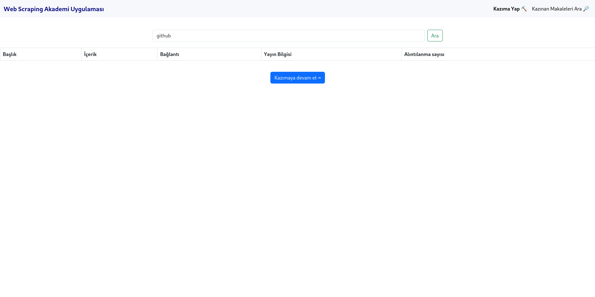

# Installation

MongoDB, Python 3.10

```
$ git clone https://github.com/th103/scrape-academic
$ cd scrape-academic
$ pip install -r requirements.txt
```

Optional: If you want to use internal search page, sync the mongoDB with elasticsarch and change the credentials

# Run

```
$ python app.py
```

# Web Scrapping Akademi Uygulaması

Uygulama Google Scholar üzerinden anahtar kelime aratarak bulduğu pdfleri indirmeyi dener. İndirilen PDF'lerin özet, anahtar kelime vb. bilgileri PDF işleme kütüphanesiyle çıkartılır ve MongoDB veritabanına kaydedilir. MongoDB veritabanı ve Elasticsearch senkronize edilirse arama sayfası üzerinden indirilen PDF'ler aratılabilir. IP limitini atlamaya çalışmak amaçlı bir özelliği yoktur.

# Uygulama içi ekran görüntüleri


